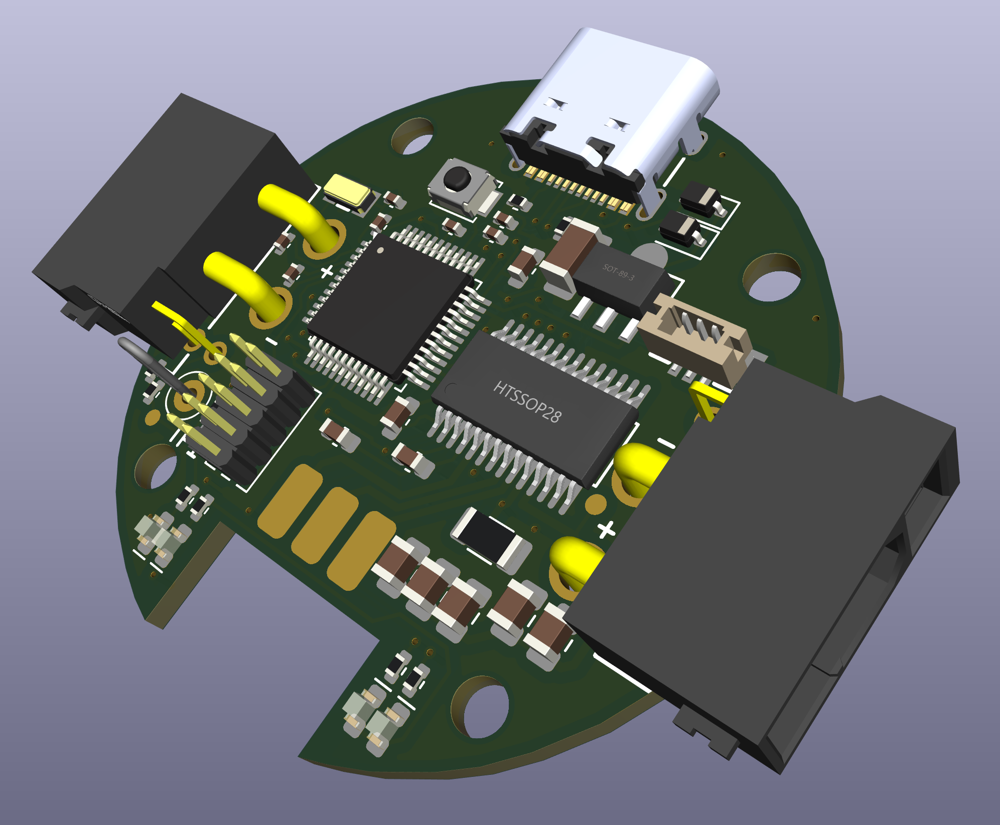

# SAMD21 BLDC Driver
Brushless motor driver board based on a SAMD21 microcontroller and DRV8313 driver

This driver is inspired by the project from Jordan Cormack that is presented there: https://cormack.xyz/L433motordriver/
Being far more familiar with the SAMD21 microntroller, I used that one instead of the STM32 of Dr. Cormack's design. The input lines are also now using I2C instead of CAN bus. Pinout is compatible with the Seeeduino XIAO board (https://wiki.seeedstudio.com/Seeeduino-XIAO/) so you can use their firmware to flash the board and then, program it using the USB-C port. See: https://emalliab.wordpress.com/2023/03/12/unbricking-a-seeed-xiao-samd21/ for instructions.

The controllers are daisy chainable and up to approx. 8A are acceptable so up to 8 GM3506 motors could be connected in series. Maximal input voltage on the XT30 power lines is 60V. Maximal output current per board is around 2-2.5A, depending on cooling. CAD models for 3D printing enclosures are also provided.

Contents:
- Gerber/: zip file with the gerber and drill files. PCA files also provided: bom and component location files
- Images/: pics
- Circuit/: xml BOM and 3D step model of the board
- Enclosure/: 3D files for two versions of an enclosure for the motor and board

Prof. Lionel Birglen 
Polytechnique Montreal, 2026 
License: GNU GPL v3
