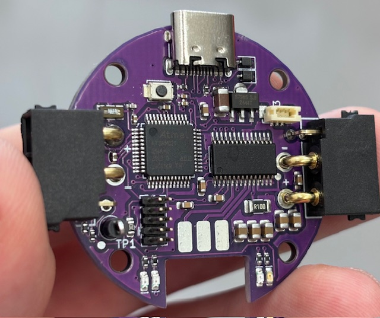
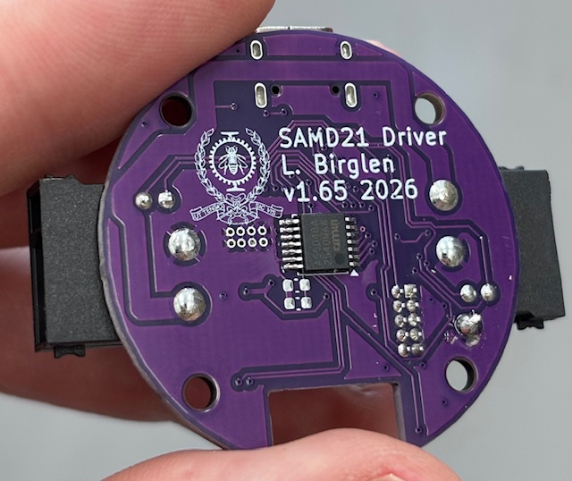

# SAMD21 BLDC Driver for the IFlight GM3506 and GM4108 Motors

Brushless motor driver board based on a SAMD21 microcontroller and DRV8313 driver with a form factor fitting the IFlight GM3506 Motor.

## Overview

This driver is inspired by a great project from Jordan Cormack: <https://cormack.xyz/L433motordriver/> but with no source provided (yet?), I decided to share here my own version of this board. Being far more familiar with the SAMD21 microcontroller, I used that one instead of the STM32 in Dr. Cormack's design. The board has only two electrical layers so it is *extremely* cheap to manufacture. I am using lines PA08 and PA09 for communication which correspond to the I2C port instead of a CAN bus. Therefore, these lines are simpler to use but careful, a big drawback is that it means that **these pins are now only 3.3V tolerant**. Two 10k pullup resistors are integrated to these input lines for convenience and can be relied upon to set the voltage reference if the board is controlled from an open collector output.

## XIAO Compatibility & Programming

The whole board is pin for pin compatible with the Seeeduino XIAO SAMD21 embodiment (<https://wiki.seeedstudio.com/Seeeduino-XIAO/>) so you can use their firmware to flash the board and then, program it using the USB-C port as if it was a XIAO. The input lines then become D4 and D5 for you to use as you like (I2C or GPIO). See: <https://emalliab.wordpress.com/2023/03/12/unbricking-a-seeed-xiao-samd21/> for instructions on how to flash the board through the available SWDIO 2x5 connector whose **key pin is indicated by the K letter on the silkscreen**. Programming through the SWDIO connector is also possible of course. In the following, Seeedstudio equivalent lines are indicated betweeen parentheses.

## Power & Daisy-Chaining

Controllers can be daisy chained and approx. 8A can be passed from one board to the next based on a temperature estimation by software so up to 8 GM3506 motors could be connected in series using the 1A maximal current recommended by IFlight for GM3506s. Maximal input voltage on the XT30 power lines is 25V. Maximal output current per board is around 2-2.5A, depending on cooling and ambient temperature.

There is an available connector on the board that is compatible with the BSB0203HA3-00CER 20mm fan (Digikey ref. 603-2068-ND) but after experimenting with the latter I noticed its cooling power is frankly quite limited and if you block its fins by accident the current drawn will shoot up which causes a brownout of the SAMD21. So I cannot advice using this fan and removed the files of the 3D printed enclosure I made which included a place to attach this fan. Alternatively, this connector could be used to power additional components, there are three lines available on the BM03B-SURS-TF connector: GND, NC, and 3.3V.

## Pinout

**DRV8313 power driver control:**

| Function | SAMD21 Pin | XIAO Equivalent |
|---|---|---|
| Enable | PA02 | D0 |
| PWM1 | PB08 | D6 |
| PWM2 | PA04 | D1 |
| PWM3 | PB09 | D7 |

No feedback from the DRV8313 is read due to routing complexity with only two layers. Low side total current sensing is available through a 0.1 ohm power resistor connected to the PA10 line (A2).

**AS5048A encoder (mounted on the backside, center of the board, connected via SPI):**

| Function | SAMD21 Pin | XIAO Equivalent |
|---|---|---|
| MISO | PA05 | D9 |
| MOSI | PA06 | D10 |
| CLK | PA07 | D8 |
| SS | PA11 | D3 |

The decoupling capacitors close to that chip are recommended but can be left unpopulated without issues from my experiments due to the very close quite large bank of bulk capacitors located on the other side of the board.

## LEDs & Power Source

There are four LEDs located besides the motor soldering pads, the red one indicates that 3.3V power is active. The other three are available to the user, if you use the Seeestudio firmware, one will blink during serial communication (green) and the other two (orange) are connected to the Rx/Tx lines.

Powering the board with 3.3V is done through either the USB lines or the XT30 power connector. Switching from one power source to the other is automatic since both lines are OR-ed and protected with 1N5819WS diodes.

## Software

For actual control of the motor, the SimpleFOC library works very well and is recommended, see: <https://simplefoc.com/>. CAD files for a 3D printing enclosure are also provided in this repository.

## Repository Contents

- `Circuit/`: interactive html BOM with component location and 3D step model of the populated board
- `Enclosures/`: files for 3D printing a proposed enclosure for the GM3506 and GM4108 motors and board
- `Gerber/`: zip file with the gerber and drill files for manufacturing. PCA files are also provided if factory assembly is desired: bom and verified component location files (see note below)
- `Media/`: general pics and videos

Note: since only the AS5048A is on the backside, manual soldering of the latter is assumed.

## Pictures

Pictures of fully assembled boards:

## Video

Demonstration of the position control of two motors in series using SimpleFOC. When the white button is pressed, left motor turns 180 degrees while the right one makes a full turn. Measured response time is around 180 ms.

## Version History

- v1.65: initial release
- v1.66: pullup resistors changed to 10k (better when multiple drives are daisy chained), trimmed sharp pcb edges, minor adjustments to silkscreen

---

Prof. Lionel Birglen
Polytechnique Montreal, 2026
License: GNU GPL v3

## DISCLAIMER

This hardware project is provided "as is", and at your own risk. Under no circumstances shall any author be liable for direct, indirect, special, incidental, or consequential damages resulting from the use, misuse, or inability to use this hardware/software, even if the authors have been advised of the possibility of such damages.
